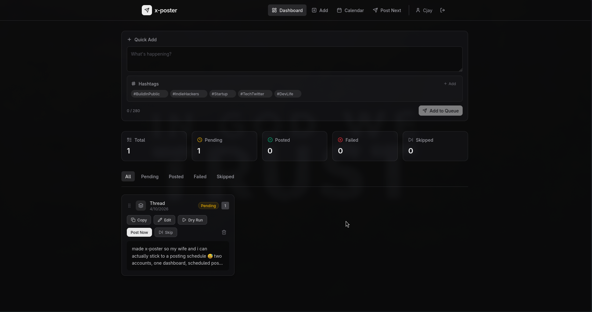
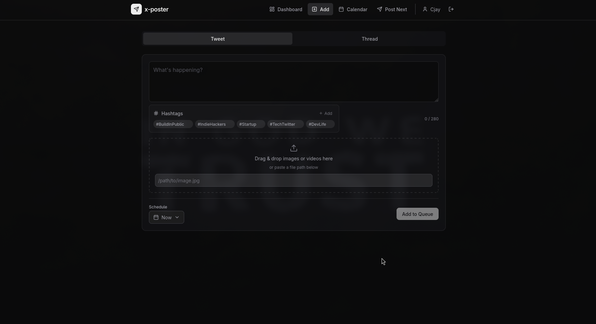
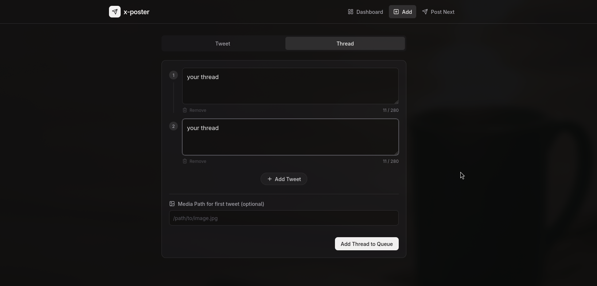
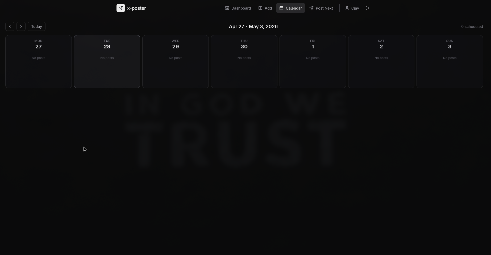
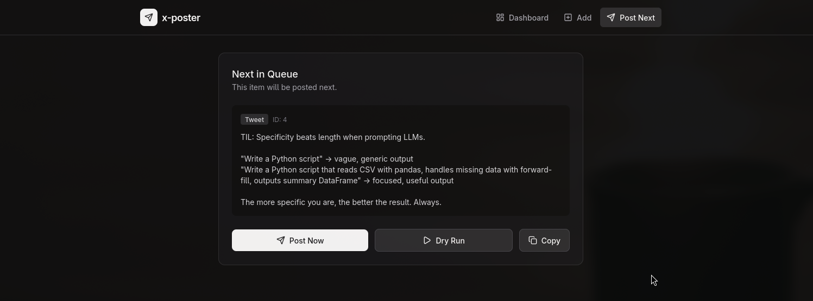

# x-poster

A self-hosted tweet queue manager with a dark-themed web dashboard. Draft tweets, organize threads, and post to X — either via the API or one-click copy to clipboard.


## Why X-Poster?

X's native composer is fine for single tweets. But if you're building in public, managing a content calendar, or coordinating threads across multiple projects — you need a queue.

X-Poster gives you:

## X-Poster Features

## Open Source

Everything here is free and open source. Host it yourself, modify it, etc.

### Dashboard

- Dashboard with your queued X-posts with a nice input to queue your x post

### Queue Management

- Add individual tweets to queue
- Add threads (multiple tweets in sequence) to queue
- Drag-and-drop to reorder queue items
- Skip, retry, and delete queue items
- View queue filtered by status (All, Pending, Posted, Failed, Skipped)
- Copy tweet/thread text to clipboard

### Multi-User Support

- User accounts with username/password authentication
- Per-user Twitter API credentials
- Separate queues per user
- Session-based authentication with cookies
- Each user posts from their own X account

### Scheduling System

- Schedule tweets and threads for specific date/time
- Quick-schedule options (Today, Tomorrow)
- Suggested posting times (static):
  - Morning (9:00 AM)
  - Lunch (12:00 PM)
  - Evening (5:30 PM)
  - Night (8:00 PM)
- Custom date/time picker
- Calendar view to see scheduled posts for the week
- Lazy scheduler: scheduled posts auto-post when they're due
- Reschedule or remove schedule from calendar

### Media Upload

- Drag-and-drop images/videos into composer
- Multiple media files per tweet
- Visual file list with remove option

### Posting

- Post next pending item manually
- Dry-run mode to preview before posting
- Automatic rate limit checking
- Post using account's Twitter credentials

### Technical

- Self-hosted (no cloud dependency)
- Dark theme UI
- Built with Bun, React 19, Tailwind v4, TypeScript
- OAuth 1.0a implemented from scratch
- JSON file-based storage per user

---

## Screenshots

### Dashboard



### Add Tweet



### Add Thread



### Calendar



### Post Next



## Quick Start

**Important**: If you don't have API credits, use the Copy button to manually paste tweets into X.

### Prerequisites

- [Bun](https://bun.sh/) v1.0+
- (Optional) X Developer API credentials for direct posting

### Install

```bash
git clone https://github.com/CjLogic/x-poster.git
cd x-poster
bun install
```

## Self-Hosting Setup

Requirements:

- Bun runtime
- X Developer account with API credentials

```bash
bun install
bun run src/index.ts user add <username> <password>
bun run src/index.ts user set-twitter <username>
bun run src/server.ts
```

### Configure

```bash
cp .env.example .env
```

Edit `.env` with your X API credentials (only needed for direct posting):

```env
X_CONSUMER_KEY=your-consumer-key
X_CONSUMER_SECRET=your-consumer-secret
X_ACCESS_TOKEN=your-access-token
X_ACCESS_TOKEN_SECRET=your-access-token-secret
```

**No API credentials?** No problem. x-poster works perfectly as a draft manager with one-click copy to clipboard. Just skip the `.env` setup.

### Run the Dashboard

```bash
bun run dev
```

Open **<http://localhost:3001>** — that's it.

## Usage

### Web Dashboard

The easiest way to use x-poster. Start the server and manage everything from your browser.

| Tab | What it does |
|---|---|
| **Dashboard** | View all queued tweets, filter by status, skip/retry/delete |
| **Add Tweet** | Compose single tweets or threads with character counters |
| **Post Next** | Preview the next tweet, copy it, or post via API |

Every tweet card has a **Copy** button that copies the text to your clipboard. For threads, each tweet is separated by `---` so you can paste them individually.

### CLI

You can also manage the queue from your terminal:

```bash
# Add a tweet
bun run src/index.ts add "Your tweet text here"

# Add a thread
bun run src/index.ts add --thread --text "First tweet" --text "Second tweet" --text "Third tweet"

# Add with media
bun run src/index.ts add "Check this screenshot" --media ./screenshots/demo.png

# List all items
bun run src/index.ts list

# List only pending
bun run src/index.ts list --pending

# Post next pending item (requires API credentials)
bun run src/index.ts post

# Preview without posting
bun run src/index.ts post --dry-run

# Skip an item
bun run src/index.ts skip 3

# Retry a failed item
bun run src/index.ts retry 7
```

## X API Setup (Optional)

If you want direct posting, you need X Developer API credentials:

1. Go to [developer.x.com](https://developer.x.com)
2. Create a project and app
3. Set **App permissions** to **Read and Write**
4. Generate **Consumer Keys** (API Key + Secret)
5. Generate **Access Token and Secret** (with Read + Write permissions)
6. Fill in your `.env` file

> **Important**: If you change permissions after generating tokens, you must regenerate the Access Token. Old tokens keep the old permission level.

**X API Pricing**: The free tier may have limited posting credits. Check the [current X API documentation](https://developer.x.com/en/docs/x-api) for the latest pricing. If you don't have API credits, use the Copy button to manually paste tweets into X.

## Architecture

```
x-poster/
├── src/
│   ├── server.ts       # Bun HTTP API server + static file serving
│   ├── index.ts         # CLI entry point
│   ├── auth.ts          # OAuth 1.0a signing (from scratch, no deps)
│   ├── api.ts            # X API v2 calls (post, thread, media, rate limits)
│   ├── queue.ts          # JSON queue management
│   └── types.ts          # TypeScript interfaces
├── frontend/
│   ├── src/
│   │   ├── App.tsx              # Main app with tab navigation
│   │   ├── api.ts               # API client
│   │   ├── types.ts             # Shared types
│   │   └── components/
│   │       ├── StatsCards.tsx    # Queue stats dashboard
│   │       ├── QueueList.tsx     # Filterable queue list
│   │       ├── QueueItemCard.tsx # Tweet card with Copy button
│   │       ├── AddTweetForm.tsx  # Single tweet composer
│   │       ├── AddThreadForm.tsx # Multi-tweet thread composer
│   │       ├── PostNextPanel.tsx # Post/Copy/Dry-run panel
│   │       ├── StatusBadge.tsx   # Color-coded status badges
│   │       └── Toast.tsx         # Notification toasts
│   └── ...config files
├── content/
│   └── queue.json       # Your tweet queue (auto-created, gitignored)
├── frontend-dist/       # Built frontend (served by Bun)
└── .env                 # Your API keys (gitignored)
```

**Key design decisions:**

- **OAuth 1.0a from scratch** — no external OAuth dependencies, uses Bun's Web Crypto API
- **Local-first** — queue is a JSON file, no database required
- **Bun.serve** — no Express/Hono, the server is ~180 lines
- **React + Tailwind v4** — minimal frontend, no UI framework dependencies
- **Copy-first workflow** — the API is optional, clipboard is always available

## API Endpoints

The Bun server exposes these REST endpoints:

| Method | Endpoint | Description |
|---|---|---|
| GET | `/api/queue` | List all items (filter: `?status=pending`) |
| GET | `/api/queue/stats` | Get counts by status |
| POST | `/api/queue` | Add tweet or thread |
| POST | `/api/queue/post` | Post next pending to X |
| POST | `/api/queue/post/dry-run` | Preview next without posting |
| POST | `/api/queue/:id/skip` | Mark as skipped |
| POST | `/api/queue/:id/retry` | Reset failed to pending |
| DELETE | `/api/queue/:id` | Remove from queue |
| POST | `/api/auth/login` | Login with username/password |
| POST | `/api/auth/logout` | Logout |
| POST | /api/auth/register | Create account |
| GET | /api/auth/me | Get current user |
| POST | /api/auth/twitter | Set Twitter credentials |
| GET | /api/auth/twitter | Check if Twitter is configured |

## Backend

```bash
src/users.ts - User management with bcrypt password hashing
src/sessions.ts - Cookie-based session management (7-day expiry)
src/queue.ts - Per-user queues at content/queues/{username}.json
src/server.ts - Auth middleware + new endpoints
Auth Endpoints:
```

## Login Frontend

```bash
LoginPage.tsx - Login/register form
App.tsx - Auth state check, account settings modal
```

## CLI Commands

```bash
# Create user
bun run src/index.ts user add <username> <password>

# Set Twitter credentials for user
bun run src/index.ts user set-twitter <username>

# Then configure env vars and run:
bun run src/index.ts user set-twitter myuser
```

## Development

```bash
# Start the API server
bun run dev

# Start frontend dev server (hot reload)
cd frontend && npm run dev

# Type check
bun run typecheck

# Run tests
bun run test

# Build frontend for production
cd frontend && npm run build
```

## Security

- `.env` is gitignored — never commit credentials
- OAuth 1.0a signing happens locally, tokens never leave your machine
- No cloud services, no analytics, no tracking
- If credentials are exposed, rotate them immediately at [developer.x.com](https://developer.x.com)

## License

MIT — use it, fork it, ship it.

## Contributing

PRs welcome. See [CONTRIBUTING.md](./CONTRIBUTING.md) for guidelines.

---

Built with 🔥 by [LOGIX](https://x.com/CjRamirez333)
